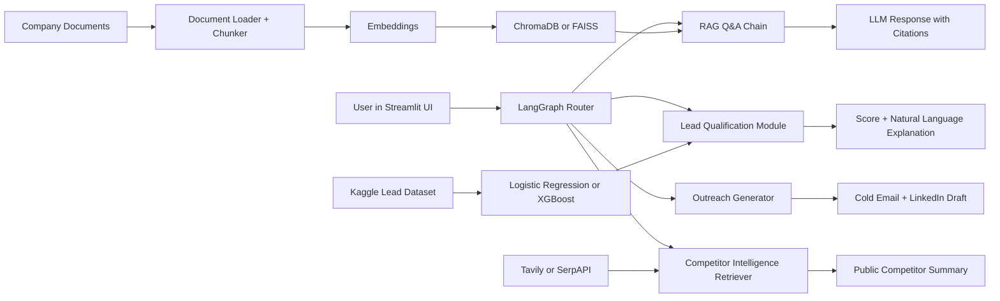

# BizPilot AI

## English

BizPilot AI is an agentic RAG-powered chatbot for digital business development. The system is designed to answer questions from company documents with citations, qualify inbound leads, draft personalized outreach messages, summarize public competitor information, and evaluate the RAG pipeline using faithfulness, context precision, and answer relevancy.

### Professor-Given Scope

- Project title: BizPilot AI: An Agentic RAG-Powered Chatbot for Digital Business Development
- LLM: Llama 3.1 / Mistral 7B through Groq or Ollama, or GPT-4o-mini / Gemini 1.5 Flash API
- Orchestration: LangChain for RAG, plus LangGraph or CrewAI for agentic routing/outreach
- Vector database: ChromaDB or FAISS
- Embeddings: sentence-transformers all-MiniLM-L6-v2 or OpenAI text-embedding-3-small
- Lead scoring: scikit-learn Logistic Regression or XGBoost on a public Kaggle lead-scoring dataset
- Web retrieval: Tavily API or SerpAPI
- Evaluation: RAGAS faithfulness, context precision, and answer relevancy
- UI/deployment: Streamlit, Hugging Face Spaces or Render free tier
- Version control: Git and GitHub with a structured README and architecture diagram

### MVP Direction

The first working MVP uses Streamlit, LangChain-ready project structure, ChromaDB/FAISS-ready document organization, sentence-transformers-ready company documents, Logistic Regression lead scoring, and RAGAS-ready evaluation planning. The current Week 1 implementation includes a Streamlit UI, lead-scoring baseline, prediction wrapper, sample company documents, and Week 1 deliverable documentation.

### Planned Architecture



### Repository Structure

- `anagorev.md`: professor-provided project scope and rules, with Turkish translation
- `docs/week1_project_proposal.md`: Week 1 project proposal
- `docs/week1_literature_review.md`: Week 1 literature review
- `docs/week1_tool_setup.md`: Python, package, API key, and Streamlit setup notes
- `docs/week1_professor_update.md`: Week 1 professor update
- `docs/week1_status_checklist.md`: Week 1 delivery checklist
- `data/company_docs/`: synthetic sample company documents for the RAG pipeline
- `data/lead_scoring/`: Kaggle dataset plan and preparation notes
- `reports/lead_scoring_baseline.md`: first Logistic Regression lead-scoring report
- `src/`: application and pipeline code
- `notebooks/`: future dataset exploration and model experiments

### Week 1 Status

Dates: 06 July - 12 July 2026

Deadline: Sunday, 12 July 2026

Week 1 deliverables are ready:

- Project proposal
- Lead-scoring dataset prepared locally
- Sample company documents for the RAG pipeline
- Literature review
- Tool setup documentation
- Streamlit MVP demo
- GitHub repository

### Run The App

```powershell
.venv\Scripts\streamlit run app.py
```

Local URL:

```text
http://127.0.0.1:8501
```

The Streamlit UI includes a Turkish / English language switch.

### Next Step

The next technical step is to connect the RAG CLI prototype to the Streamlit UI and then add an LLM generation layer.

## Türkçe

BizPilot AI, dijital iş geliştirme süreçleri için geliştirilen agentic RAG destekli bir chatbottur. Sistem; şirket dokümanlarından kaynak göstererek cevap üretmeyi, gelen lead'leri puanlamayı, kişiselleştirilmiş outreach mesajları taslaklamayı, herkese açık rakip bilgilerini özetlemeyi ve RAG hattını faithfulness, context precision ve answer relevancy metrikleriyle değerlendirmeyi amaçlar.

### Profesör Tarafından Verilen Kapsam

- Proje başlığı: BizPilot AI: An Agentic RAG-Powered Chatbot for Digital Business Development
- LLM: Groq veya Ollama üzerinden Llama 3.1 / Mistral 7B ya da GPT-4o-mini / Gemini 1.5 Flash API
- Orkestrasyon: RAG için LangChain, agentic routing/outreach için LangGraph veya CrewAI
- Vektör veritabanı: ChromaDB veya FAISS
- Embedding modeli: sentence-transformers all-MiniLM-L6-v2 veya OpenAI text-embedding-3-small
- Lead scoring: public Kaggle lead-scoring dataset üzerinde scikit-learn Logistic Regression veya XGBoost
- Web retrieval: Tavily API veya SerpAPI
- Değerlendirme: RAGAS ile faithfulness, context precision ve answer relevancy
- UI/deployment: Streamlit, Hugging Face Spaces veya Render free tier
- Versiyon kontrolü: yapılandırılmış README ve mimari diyagram ile Git/GitHub

### MVP Yönü

İlk çalışan MVP; Streamlit arayüzü, LangChain'e hazır proje yapısı, ChromaDB/FAISS için hazırlanmış doküman organizasyonu, sentence-transformers ile kullanılabilecek şirket dokümanları, Logistic Regression lead scoring modeli ve RAGAS değerlendirme planını içerir. Week 1 kapsamında Streamlit UI, lead-scoring baseline modeli, prediction wrapper, örnek şirket dokümanları ve teslim dokümanları hazırlanmıştır.

### Planlanan Mimari

Yukarıdaki Mermaid diyagramı, kullanıcı arayüzünden RAG Q&A, lead qualification, outreach generation ve competitor intelligence modüllerine giden genel sistem akışını gösterir.

### Proje Klasör Yapısı

- `anagorev.md`: profesör tarafından verilen proje kapsamı ve kurallar, Türkçe çeviriyle birlikte
- `docs/week1_project_proposal.md`: 1. hafta proje önerisi
- `docs/week1_literature_review.md`: 1. hafta literatür taraması
- `docs/week1_tool_setup.md`: Python, paket, API key ve Streamlit kurulum notları
- `docs/week1_professor_update.md`: 1. hafta profesör güncellemesi
- `docs/week1_status_checklist.md`: 1. hafta teslim kontrol listesi
- `data/company_docs/`: RAG pipeline için sentetik örnek şirket dokümanları
- `data/lead_scoring/`: Kaggle dataset planı ve hazırlık notları
- `reports/lead_scoring_baseline.md`: ilk Logistic Regression lead-scoring raporu
- `src/`: uygulama ve pipeline kodları
- `notebooks/`: ileride kullanılacak dataset inceleme ve model deneme alanı

### 1. Hafta Durumu

Tarih: 06 Temmuz - 12 Temmuz 2026

Son teslim tarihi: Pazar, 12 Temmuz 2026

Week 1 teslimleri hazır:

- Proje önerisi
- Lokal olarak hazırlanmış lead-scoring dataset
- RAG pipeline için örnek şirket dokümanları
- Literatür taraması
- Tool setup dokümantasyonu
- Streamlit MVP demosu
- GitHub repository

### Uygulamayı Çalıştırma

```powershell
.venv\Scripts\streamlit run app.py
```

Lokal adres:

```text
http://127.0.0.1:8501
```

Streamlit arayüzünde Türkçe / English dil seçimi bulunur.

### Sonraki Adım

Sonraki teknik adım, RAG CLI prototipini Streamlit UI'a bağlamak ve ardından LLM generation layer eklemektir.
