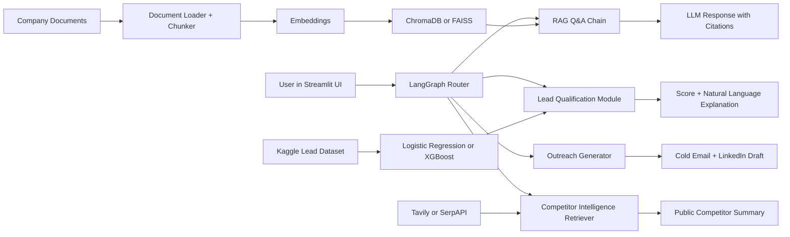

# BizPilot AI

BizPilot AI, dijital iş geliştirme süreçleri için geliştirilecek agentic RAG destekli bir chatbottur. Sistem; şirket dokümanlarına dayalı ve kaynak gösteren cevaplar üretmeyi, gelen lead'leri puanlamayı, kişiselleştirilmiş outreach mesajları taslaklamayı, herkese açık rakip bilgilerini özetlemeyi ve RAG hattını faithfulness, context precision ve answer relevancy metrikleriyle değerlendirmeyi amaçlar.

## Profesör Tarafından Verilen Kapsam

- Proje başlığı: BizPilot AI: An Agentic RAG-Powered Chatbot for Digital Business Development
- LLM: Groq veya Ollama üzerinden Llama 3.1 / Mistral 7B ya da GPT-4o-mini / Gemini 1.5 Flash API
- Orkestrasyon: RAG zincirleri için LangChain, agentic routing/outreach için LangGraph veya CrewAI
- Vektör veritabanı: ChromaDB veya FAISS
- Embedding modeli: sentence-transformers all-MiniLM-L6-v2 veya OpenAI text-embedding-3-small
- Lead scoring: public Kaggle lead-scoring dataset üzerinde scikit-learn Logistic Regression veya XGBoost
- Web retrieval: rakip analizi için Tavily API veya SerpAPI
- Değerlendirme: RAGAS ile faithfulness, context precision ve answer relevancy
- UI/deployment: hızlı geliştirme için Streamlit, Hugging Face Spaces veya Render free tier
- Versiyon kontrolü: Git ve GitHub; yapılandırılmış README ve mimari diyagram

## MVP Yönü

İlk çalışan MVP; Streamlit, LangChain, ChromaDB, sentence-transformers all-MiniLM-L6-v2, Logistic Regression, Tavily ve RAGAS kullanacaktır. Bu seçim, profesörün verdiği hedefleri kapsarken projeyi sade ve hızlı geliştirilebilir tutar.

## Planlanan Mimari



## Proje Klasör Yapısı

- `anagorev.md`: profesör tarafından verilen proje kapsamı ve kurallar
- `docs/week1_project_proposal.md`: 1. hafta proje önerisi taslağı
- `docs/week1_literature_review.md`: 1. hafta literatür taraması
- `docs/week1_tool_setup.md`: Python, paket, API key ve Streamlit kurulum notları
- `docs/week1_professor_update.md`: profesöre gönderilebilecek Week 1 durum güncellemesi
- `docs/week1_status_checklist.md`: Week 1 teslim kontrol listesi
- `data/company_docs/`: RAG pipeline için sentetik örnek şirket dokümanları
- `data/lead_scoring/`: Kaggle dataset planı ve hazırlık notları
- `reports/lead_scoring_baseline.md`: ilk Logistic Regression lead-scoring raporu
- `src/`: ileride eklenecek uygulama ve pipeline kodları
- `notebooks/`: dataset inceleme ve model denemeleri için notebook alanı

## 1. Hafta Hedefi

Tarih: 06 Temmuz - 12 Temmuz 2026

Son teslim tarihi: Pazar, 12 Temmuz 2026

Teslim edilecekler:

- Proje önerisi
- Hazır lead-scoring dataset
- RAG pipeline için örnek şirket dokümanları
- İlk literatür taraması notları

Durum: Week 1 teslim dosyaları hazırlandı.

## Öncelikli Sonraki Adım

Primary Kaggle dataset indirildi ve `data/lead_scoring/raw/` klasörüne yerleştirildi. İlk Logistic Regression baseline modeli `src/lead_scoring_baseline.py` ile çalıştırıldı.

Lead scoring tahmin modülü de `src/lead_scoring_predictor.py` ile hazırlandı. Bu dosya eğitilmiş modeli yükleyip yeni bir lead için ML skoru, kural tabanlı düzeltme, final skor ve kısa açıklama üretir.

Streamlit arayüzü `app.py` içinde hazırlandı. Uygulamayı çalıştırmak için:

```powershell
.venv\Scripts\streamlit run app.py
```

Arayüzde Türkçe / English dil seçimi bulunur. English seçilince ana panel metinleri ve lead scoring açıklamaları İngilizce gösterilir.

Sonraki adım: RAG Q&A modülünü LangChain + ChromaDB ile gerçek doküman retrieval zincirine çevirmek.
