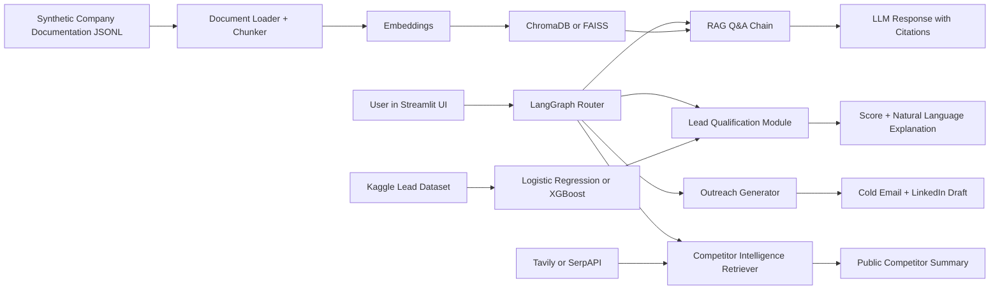

# BizPilot AI

## English

BizPilot AI is an agentic RAG-powered chatbot for digital business development. The system is designed to answer questions from company documentation with citations, qualify inbound leads, draft personalized outreach messages, summarize public competitor information, and evaluate the RAG pipeline using faithfulness, context precision, and answer relevancy.

### Professor-Given Scope

- Project title: BizPilot AI: An Agentic RAG-Powered Chatbot for Digital Business Development
- LLM: Llama 3.1 / Mistral 7B through Groq or Ollama, or GPT-4o-mini / Gemini 1.5 Flash API
- Orchestration: LangChain for RAG, plus LangGraph or CrewAI for agentic routing/outreach
- Vector database: ChromaDB or FAISS
- Embeddings: sentence-transformers all-MiniLM-L6-v2 or OpenAI text-embedding-3-small
- Lead scoring: scikit-learn Logistic Regression or XGBoost on a public Kaggle lead-scoring dataset
- Web retrieval: Tavily API or SerpAPI
- Evaluation: RAGAS faithfulness, context precision, and answer relevancy
- UI/deployment: Streamlit, Hugging Face Spaces or Render free tier
- Version control: Git and GitHub with a structured README and architecture diagram

### Current MVP Direction

The MVP uses Streamlit, ChromaDB, sentence-transformers, a synthetic company-documentation JSONL dataset, Logistic Regression lead scoring, and RAGAS-ready evaluation planning. The current implementation includes:

- Streamlit UI
- Lead-scoring baseline model and prediction wrapper
- Week 2 RAG CLI prototype
- Large synthetic BizPilot company-documentation corpus
- Week 1 and Week 2 documentation

### RAG Dataset

The active RAG corpus is not hand-written Markdown. After professor feedback, it was changed to a larger AI-synthesized JSONL dataset for a fictional but consistent BizPilot AI company. This makes the RAG demo more realistic because multi-part questions can retrieve several related chunks instead of being answered from one short paragraph.

Active dataset:

```text
data/company_docs/bizpilot_synthetic_corpus.jsonl
```

The dataset represents synthetic company-document types such as:

- product overview
- pricing and feature comparison
- RAG architecture
- lead scoring guides
- prompt-only qualification
- outreach templates
- competitor intelligence notes
- onboarding and support policy
- security and data governance
- synthetic case studies
- implementation and deployment notes

Each JSONL record contains:

- document ID
- company name
- document type
- title
- source URL
- retrieved date
- corpus type
- cleaned content

The earlier synthetic Markdown files were archived under:

```text
data/company_docs_synthetic_archive/
```

They are not used by the active RAG pipeline.

### Planned Architecture



### Repository Structure

- `anagorev.md`: professor-provided project scope and rules, with Turkish translation
- `docs/week1_project_proposal.md`: Week 1 project proposal
- `docs/week1_literature_review.md`: Week 1 literature review
- `docs/week1_tool_setup.md`: Python, package, API key, and Streamlit setup notes
- `docs/week1_professor_update.md`: Week 1 professor update
- `docs/week1_status_checklist.md`: Week 1 delivery checklist
- `docs/week2_rag_prototype.md`: Week 2 RAG prototype documentation
- `data/company_docs/bizpilot_synthetic_corpus.jsonl`: active AI-synthesized company-documentation dataset for RAG
- `scripts/generate_synthetic_company_corpus.py`: reproducible generator for the active synthetic RAG corpus
- `data/company_docs_synthetic_archive/`: archived synthetic documents from the first pipeline test
- `data/lead_scoring/`: Kaggle lead-scoring dataset notes
- `reports/lead_scoring_baseline.md`: first Logistic Regression lead-scoring report
- `src/`: application and pipeline code
- `notebooks/`: dataset exploration and model experiments

### Run The Streamlit App

```powershell
.venv\Scripts\streamlit run app.py
```

Local URL:

```text
http://127.0.0.1:8501
```

### Run The Week 2 RAG CLI

Build the RAG index:

```powershell
.venv\Scripts\python src\rag_pipeline.py build
```

Ask a question:

```powershell
.venv\Scripts\python src\rag_pipeline.py ask "Which plan is best for a growing sales team and why?" --top-k 5
```

Ask with retrieval-only fallback mode:

```powershell
.venv\Scripts\python src\rag_pipeline.py ask "Which plan is best for a growing sales team and why?" --top-k 5 --no-llm
```

Show index stats:

```powershell
.venv\Scripts\python src\rag_pipeline.py stats
```

### Run The Week 3 Lead Scoring Module

Train or refresh the Logistic Regression model:

```powershell
.venv\Scripts\python src\lead_scoring_baseline.py
```

Score one demo lead:

```powershell
.venv\Scripts\python src\lead_scoring_predictor.py
```

Score the CRM-style sample dataset:

```powershell
.venv\Scripts\python src\lead_scoring_batch.py
```

The CRM sample input is:

```text
data/crm_sample_leads/crm_leads_sample.csv
```

The batch output is:

```text
data/crm_sample_leads/scored_crm_leads.csv
```

Optional LLM explanation mode uses the normal OpenAI API. Configure `OPENAI_API_KEY` and keep `OPENAI_MODEL=gpt-5.4` in `.env`.

In the Streamlit Lead Qualification tab, users can score a lead through a standalone natural-language prompt without filling the structured form. The structured CRM form remains available as a separate manual input mode.

### Current RAG Status

The RAG Q&A module is connected to Streamlit and now includes an LLM generation layer. It retrieves cited context from ChromaDB first, then asks the configured LLM provider to answer only from that context. The RAG tab also includes a custom answer prompt for tone, format, and business focus. If the provider is unavailable, the system falls back to extractive citation output.

## Türkçe

BizPilot AI, dijital iş geliştirme süreçleri için geliştirilen agentic RAG destekli bir chatbottur. Sistem; şirket dokümantasyonundan kaynak göstererek cevap üretmeyi, gelen lead'leri puanlamayı, kişiselleştirilmiş outreach mesajları taslaklamayı, herkese açık rakip bilgilerini özetlemeyi ve RAG hattını faithfulness, context precision ve answer relevancy metrikleriyle değerlendirmeyi amaçlar.

### Profesör Tarafından Verilen Kapsam

- Proje başlığı: BizPilot AI: An Agentic RAG-Powered Chatbot for Digital Business Development
- LLM: Groq veya Ollama üzerinden Llama 3.1 / Mistral 7B ya da GPT-4o-mini / Gemini 1.5 Flash API
- Orkestrasyon: RAG için LangChain, agentic routing/outreach için LangGraph veya CrewAI
- Vektör veritabanı: ChromaDB veya FAISS
- Embedding modeli: sentence-transformers all-MiniLM-L6-v2 veya OpenAI text-embedding-3-small
- Lead scoring: public Kaggle lead-scoring dataset üzerinde scikit-learn Logistic Regression veya XGBoost
- Web retrieval: Tavily API veya SerpAPI
- Değerlendirme: RAGAS ile faithfulness, context precision ve answer relevancy
- UI/deployment: Streamlit, Hugging Face Spaces veya Render free tier
- Versiyon kontrolü: yapılandırılmış README ve mimari diyagram ile Git/GitHub

### Mevcut MVP Yönü

MVP; Streamlit, ChromaDB, sentence-transformers, synthetic company-documentation JSONL dataset, Logistic Regression lead scoring modeli ve RAGAS değerlendirme planını kullanır. Mevcut implementasyonda şunlar vardır:

- Streamlit UI
- Lead-scoring baseline modeli ve prediction wrapper
- 2. hafta RAG CLI prototipi
- Büyük synthetic BizPilot company-documentation corpus
- 1. ve 2. hafta dokümantasyonu

### RAG Dataset

Aktif RAG corpus, elle yazılmış Markdown dosyaları değildir. Profesör geri bildiriminden sonra veri, fictional ama tutarlı BizPilot AI şirketi için oluşturulmuş daha büyük AI-synthesized JSONL dataset formatına taşındı. Bu, RAG demosunu daha gerçekçi yapar çünkü multi-part sorular tek kısa paragraftan değil, birden fazla ilgili chunk'tan cevaplanabilir.

Aktif dataset:

```text
data/company_docs/bizpilot_synthetic_corpus.jsonl
```

Dataset içinde temsil edilen synthetic doküman tipleri:

- product overview
- pricing ve feature comparison
- RAG architecture
- lead scoring guides
- prompt-only qualification
- outreach templates
- competitor intelligence notes
- onboarding ve support policy
- security ve data governance
- synthetic case studies
- implementation ve deployment notes

Her JSONL kaydında şunlar bulunur:

- document ID
- company name
- document type
- title
- source URL
- retrieved date
- corpus type
- cleaned content

Önceki sentetik Markdown dosyaları şu klasöre arşivlendi:

```text
data/company_docs_synthetic_archive/
```

Bu dosyalar aktif RAG pipeline tarafından kullanılmaz.

### Planlanan Mimari

Yukarıdaki Mermaid diyagramı; kullanıcı arayüzünden RAG Q&A, lead qualification, outreach generation ve competitor intelligence modüllerine giden genel sistem akışını gösterir.

### Proje Klasör Yapısı

- `anagorev.md`: profesör tarafından verilen proje kapsamı ve kurallar, Türkçe çeviriyle birlikte
- `docs/week1_project_proposal.md`: 1. hafta proje önerisi
- `docs/week1_literature_review.md`: 1. hafta literatür taraması
- `docs/week1_tool_setup.md`: Python, paket, API key ve Streamlit kurulum notları
- `docs/week1_professor_update.md`: 1. hafta profesör güncellemesi
- `docs/week1_status_checklist.md`: 1. hafta teslim kontrol listesi
- `docs/week2_rag_prototype.md`: 2. hafta RAG prototipi dokümantasyonu
- `data/company_docs/bizpilot_synthetic_corpus.jsonl`: aktif AI-synthesized company-documentation RAG dataset
- `scripts/generate_synthetic_company_corpus.py`: aktif synthetic RAG corpus için reproducible generator
- `data/company_docs_synthetic_archive/`: ilk pipeline testinden kalan arşivlenmiş sentetik dokümanlar
- `data/lead_scoring/`: Kaggle lead-scoring dataset notları
- `reports/lead_scoring_baseline.md`: ilk Logistic Regression lead-scoring raporu
- `src/`: uygulama ve pipeline kodları
- `notebooks/`: dataset inceleme ve model deneme alanı

### Streamlit Uygulamasını Çalıştırma

```powershell
.venv\Scripts\streamlit run app.py
```

Lokal adres:

```text
http://127.0.0.1:8501
```

### 2. Hafta RAG CLI Çalıştırma

RAG index oluştur:

```powershell
.venv\Scripts\python src\rag_pipeline.py build
```

Soru sor:

```powershell
.venv\Scripts\python src\rag_pipeline.py ask "Which plan is best for a growing sales team and why?" --top-k 5
```

Sadece retrieval fallback modu ile soru sor:

```powershell
.venv\Scripts\python src\rag_pipeline.py ask "Which plan is best for a growing sales team and why?" --top-k 5 --no-llm
```

Index istatistiklerini göster:

```powershell
.venv\Scripts\python src\rag_pipeline.py stats
```

### 3. Hafta Lead Scoring Modülünü Çalıştırma

Logistic Regression modelini eğit veya yenile:

```powershell
.venv\Scripts\python src\lead_scoring_baseline.py
```

Tek demo lead skorla:

```powershell
.venv\Scripts\python src\lead_scoring_predictor.py
```

CRM-style sample dataset skorla:

```powershell
.venv\Scripts\python src\lead_scoring_batch.py
```

CRM sample input:

```text
data/crm_sample_leads/crm_leads_sample.csv
```

Batch output:

```text
data/crm_sample_leads/scored_crm_leads.csv
```

Opsiyonel LLM explanation modu normal OpenAI API kullanır. `.env` içinde `OPENAI_API_KEY` girilir ve `OPENAI_MODEL=gpt-5.4` kalır.

Streamlit Lead Qualification tab'ında kullanıcı structured CRM formunu doldurmadan standalone natural-language lead prompt ile skor alabilir. Structured CRM form ayrı bir manuel input modu olarak durur.

### Mevcut RAG Durumu

RAG Q&A modülü Streamlit'e bağlandı ve artık LLM tabanlı generative answer layer içeriyor. Sistem önce ChromaDB'den citation'lı context retrieve eder, sonra yapılandırılmış LLM provider'a yalnızca bu context üzerinden cevap ürettirir. RAG tab'ında tone, format ve business focus için custom answer prompt alanı da bulunur. Provider erişilemezse sistem extractive citation output'a fallback yapar.
